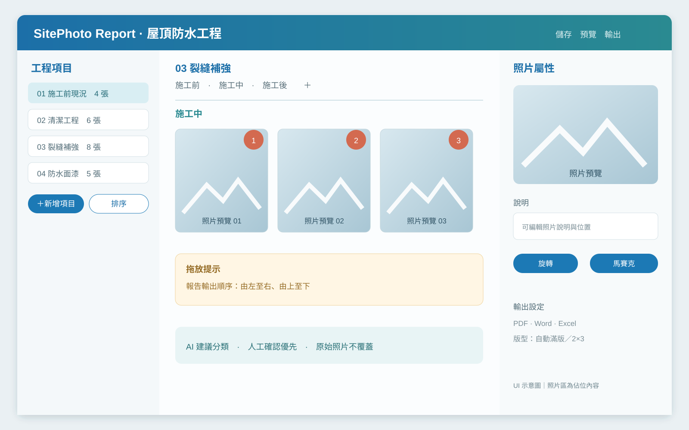
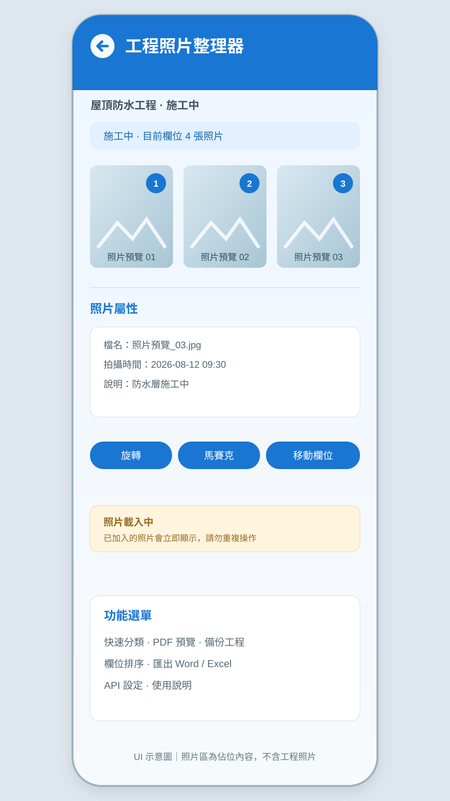
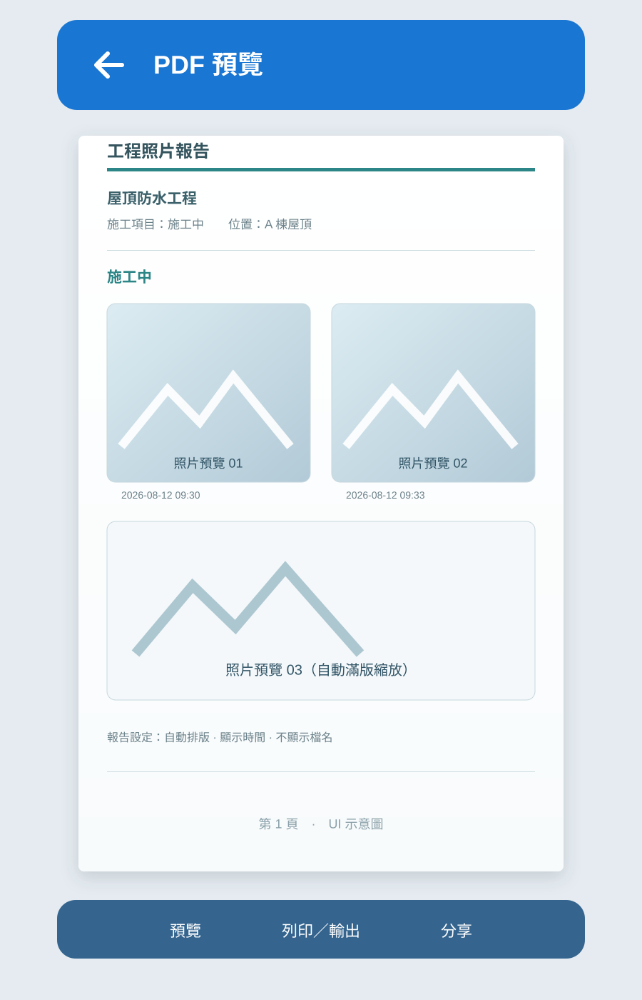

# 工程照片整理器 SitePhoto Report

工程現場照片整理、分類與報告產生工具，作者與維護者為 [@jojo5211-bit](https://github.com/jojo5211-bit)。

SitePhoto Report 專門處理工程現場常見的照片工作：把施工前、中、後或改善前、後的照片整理到正確項目，調整照片順序、補充說明、標記照片編號，最後輸出可以交付給業主、監造或總包的工程照片報告。

本專案包含 Windows 桌面版與 Android 手機版，採離線優先設計。原始照片、工程資料與 API 設定留在使用者自己的裝置與工程專案中，公開 GitHub repository 不包含任何使用者工程照片或私人金鑰。

## 目前版本

| 版本 | 目前版本 | 適合用途 |
|---|---:|---|
| Windows 桌面版 | `0.8.1` | 回公司整理大量照片、批次操作與正式輸出 |
| Android 手機版 | `1.1.3+14` | 工地現場拍照、快速分類、編號與 PDF 預覽 |

Android 最新版本可從 [GitHub Releases](https://github.com/jojo5211-bit/SitePhotoReport/releases) 下載。正式 APK 不放在原始碼根目錄，而是放在對應的 Release 附件中。

## 這個作品解決什麼問題

工程照片通常需要依照工程項目、施工位置與施工階段整理，例如：

- 施工前現況
- 施工中紀錄
- 施工後完成面
- 改善前／改善後
- 材料進場
- 隱蔽工程
- 尺寸與施工範圍
- 完工清潔

如果使用檔案總管逐張重新命名、建立資料夾、拖曳照片、補照片說明，再手動貼到 Word，照片一多就很容易漏分類、順序錯誤或輸出時跑版。

SitePhoto Report 把這些工作集中在同一個工程專案中：

1. 建立工程基本資料。
2. 建立工程項目與自訂照片欄位。
3. 匯入或直接拍攝照片。
4. 將照片放入未分類區，再以手動、批次或 AI 建議完成分類。
5. 調整欄位順序與照片順序。
6. 編輯照片、說明、位置、馬賽克與編號。
7. 預覽報告並輸出 PDF、Word 或 Excel。

核心原則是：手動功能永遠可用，AI 只負責加速；原始照片不被覆蓋，所有人工修正都可以保留與復原。

## 完整功能說明

### 1. 工程案件與基本資料

每個工程可以獨立保存，並記錄：

- 工程名稱、工程編號與報告名稱
- 工程地點
- 業主、承包商與承辦人
- 開工日期與完工日期
- 公司名稱與公司 Logo
- 工程說明與報告備註
- 預設工程位置與固定輸出位置

未填寫的工程資料不會在報告中產生「未填寫」或多餘空白欄位。工程完成後可以重新開啟、另存副本、備份或移動整個專案資料夾。

### 2. 工程項目與照片欄位

左側工程項目清單就是報告章節順序。項目與欄位都支援：

- 新增、改名與刪除
- 上移、下移與拖曳排序
- 一次輸入最多 10 個項目或欄位名稱
- 空白名稱自動略過，不建立空白項目
- 單一照片欄位
- 施工前／施工中／施工後
- 改善前／改善後
- 自訂欄位，例如清洗、底漆、第一層防水、面漆與完工
- 欄位右側快速新增欄位
- 欄位右鍵刪除，照片可回到未分類，不直接刪除原始檔

項目順序、欄位順序與照片順序分開保存，因此調整其中一項不會意外改變其他位置。

### 3. 照片匯入與現場拍攝

支援 JPG、JPEG、PNG、WEBP 與 BMP 等常見格式。Windows 桌面版可從檔案總管一次拖曳多張照片到未分類區；Android 版可以從手機相簿批次選取，或在目前項目／欄位內直接拍照。

匯入流程會：

1. 檢查檔案是否存在、格式是否可讀。
2. 使用 SHA-256 檢查完全重複照片。
3. 讀取 EXIF 拍攝時間、尺寸、方向、相機資訊與可用的 GPS。
4. 保留原始照片到工程專案的 `originals/`。
5. 建立縮圖與預覽圖，讓大量照片可以快速瀏覽。
6. 顯示載入進度，避免使用者誤以為匯入失敗而重複操作。

Android 版在項目內直接拍攝照片時，會同時保存一份到工程專案與手機內建相簿。若使用者拒絕相簿權限，工程專案內的照片仍會正常保存。

### 4. 未分類區、日期與檔名排序

未分類區是所有新匯入照片的安全暫存位置，不會因為 AI 無法判斷就讓照片消失。

未分類照片可依下列方式排列：

- 拍攝時間由早到晚
- 拍攝時間由晚到早
- 檔名遞增
- 檔名遞減
- 原始匯入順序
- 手動排序

有 EXIF 日期的照片會依日期排列並顯示日期分隔線；沒有日期的照片會依規則排在最後。後續再加入新照片時，也會按照目前排序方式重新放入正確位置。

其他項目與欄位也可以依拍攝時間或檔名重新排序；手動拖曳後，報告會按照欄位由左至右、由上至下輸出。

### 5. 手動分類、多選與拖放

照片工作區支援：

- 單選照片
- Ctrl／Shift 多選
- 框選照片
- 單張或多張跨欄位拖曳
- 從未分類拖到項目或指定欄位
- 同一欄位內拖曳調整照片順序
- 複製照片到另一個欄位而保留原位置
- 批次移動、批次設定階段與批次編輯說明
- 右鍵移動、複製、刪除、排除輸出或開啟原始檔
- Ctrl+Z 復原與 Ctrl+Y 重做

照片從欄位移除時，預設只移除工程中的 placement 或移回未分類，不會直接破壞原始照片。

### 6. 照片檢視與編輯

照片屬性區可以查看照片預覽、原始檔名、拍攝時間、照片尺寸、所在項目與欄位。

支援的照片處理包括：

- 左轉 90 度、右轉 90 度與 180 度旋轉
- 全圖顯示、放大、縮小與拖曳平移查看細節
- 照片說明與施工位置編輯
- 從報告中排除，但保留在工程專案
- 馬賽克筆刷塗抹
- 方形、圓形與手動描邊選取
- 自訂筆刷大小與模糊力度
- 建立馬賽克副本，選擇報告使用原版或編輯版

旋轉、裁切與馬賽克採非破壞式處理，原始照片仍會保留在工程專案中。

### 7. 照片編號

可以針對目前欄位生成照片編號，不會影響其他欄位。編號設定包括：

- 左上、右上、左下、右下位置
- 自訂數字顏色
- 自訂數字大小
- 透明底或色塊底
- 依照片目前順序生成 1、2、3、4……
- 一鍵取消目前欄位編號

編號是報告渲染層的標記，不會寫入原始照片；輸出 PDF 時會使用帶編號的渲染結果。

### 8. AI 視覺分類

使用者先建立工程項目與欄位，再於設定中建立支援圖片輸入的視覺 API。AI 只會在現有的項目與欄位中提出分類建議，不會擅自建立未知欄位。

AI 分類流程：

1. 讀取未分類照片與照片 metadata。
2. 將照片送給選定的視覺模型。
3. 回傳建議項目、建議欄位、信心度與判斷原因。
4. 高信心且能對應現有欄位的照片先放入建議位置。
5. 低信心、無法對應或 API 失敗的照片留在未分類／待確認區。
6. 使用者可以全部接受、逐張修正、批次修改、退回未分類或手動拖放。

AI 不會覆蓋已經人工確認或人工移動的照片。外部 API 可能會接收工程照片，使用前請確認業主、監造與公司資料政策允許。

### 9. 報告預覽與輸出

報告設定可以個別選擇 PDF、Word、Excel，也可以對單一格式分別預覽與輸出。輸出檔案會放在固定輸出位置的工程專屬資料夾內，同名檔案會自動加上 `_1`、`_2`，不覆蓋舊檔。

#### PDF

- 工程基本資料封面
- 工程項目與欄位章節
- 黑白省墨版、清爽藍綠版與暖色工程版模板
- 每頁 1、2、4 或 6 張照片
- 2 張上下排列、4 張 2×2、6 張 2×3
- 依照片比例縮放並盡量滿版，不拉伸照片
- 每個項目／欄位可以從新頁開始，避免標題與照片被拆到不同頁
- 可開關照片編號、拍攝時間、原始檔名、施工位置與照片說明
- 支援 PDF 預覽載入提示

#### Word

Word 適合交付前再次編輯，會保留封面、工程資料、章節標題、照片、照片編號、說明、頁首頁尾與頁碼。

#### Excel

Excel 主要作為照片清冊，包含照片編號、工程項目、欄位、施工位置、拍攝時間、原始檔名、縮圖與照片說明，並設定篩選、欄寬與列印範圍。

### 10. 設定與輸出位置

設定功能可以保存：

- 預設工程資料與工程儲存位置
- PDF、Word、Excel 固定輸出位置
- 是否顯示照片拍攝時間
- 是否顯示原始檔名
- 是否輸出照片編號
- 輸出後是否自動開啟資料夾
- 多組 OpenAI 相容 API 的 endpoint、模型、金鑰與名稱
- API 儲存、測試接通、切換與刪除

API 金鑰只保存於本機使用者設定，不會寫入公開 repository，也不會由本專案提供任何金鑰。

### 11. 專案資料、備份與隱私

每個工程是獨立的 `.sprj` 專案資料夾，常見結構如下：

```text
工程名稱.sprj/
├─ project.sqlite       # 工程資料、項目、欄位、排序與照片關聯
├─ project.json         # 專案摘要
├─ originals/           # 原始照片
├─ thumbnails/          # 列表縮圖
├─ previews/            # 預覽圖
├─ edits/               # 旋轉、馬賽克與報告衍生圖
├─ assets/              # Logo 與其他素材
├─ exports/             # PDF、Word、Excel 輸出檔
└─ backups/             # 專案備份
```

原始照片不存入 SQLite BLOB；工程資料、使用者照片、API 設定、簽章檔、APK 與 build 快取都不應提交到 GitHub。備份時建議複製整個 `.sprj` 資料夾，而不是只複製輸出的 PDF。

## Windows 桌面版快速開始

```powershell
py -3 -m venv .venv
.\.venv\Scripts\Activate.ps1
python -m pip install -r requirements.txt
python run.py
```

執行測試：

```powershell
python -m unittest discover -s tests -v
```

建置 Windows 版本：

```powershell
.\build.ps1
```

建置會先執行測試，再產生 `dist\SitePhotoReport`；若已安裝 Inno Setup 6，也會產生安裝程式。使用者電腦不需要另外安裝 Python。

## Android 手機版快速開始

```powershell
cd mobile
flutter pub get
flutter analyze
flutter test
flutter build apk --release
```

Android 版適合在工地直接拍攝與初步分類；回到辦公室後，可使用 Windows 版進行大量拖放、Word 與 Excel 清冊輸出。

## 文件導覽

- [完整功能與使用流程](docs/FEATURES_AND_USAGE.md)
- [Windows 使用說明](docs/USER_GUIDE.md)
- [Android 使用指南](docs/MOBILE_GUIDE.md)
- [桌面版更新紀錄](docs/CHANGELOG.md)
- [手機版更新紀錄](docs/MOBILE_CHANGELOG.md)
- [資料結構](docs/DATABASE.md)
- [畫面流程](docs/UI_FLOW.md)
- [產品規格](docs/PRD.md)
- [建置與發布](docs/BUILD_AND_RELEASE.md)
- [開發任務與驗收](docs/TASKS.md)

## 介面示意圖

以下圖片是使用照片佔位內容製作的 UI 示意，不包含任何使用者工程照片：







## 測試與版本驗證

- Windows 桌面版：`0.8.0`；使用 Python unittest。
- Android 手機版：`1.1.3+14`；使用 `flutter analyze` 與 `flutter test`。
- 每個已交付版本使用獨立 Git tag 與 GitHub Release。
- 版本變更請查看 [CHANGELOG.md](docs/CHANGELOG.md) 與 [MOBILE_CHANGELOG.md](docs/MOBILE_CHANGELOG.md)。

## 授權與使用範圍

本專案作者為 [@jojo5211-bit](https://github.com/jojo5211-bit)，採用 [PolyForm Noncommercial License 1.0.0](LICENSE)。

允許：

- 個人非商業使用
- 研究、測試與學習
- 非商業修改
- 依授權條件散布修改版本

禁止：

- 商業使用
- 將本專案或修改版本用於商業服務、收費產品或商業交付

因為本授權禁止商業用途，本專案嚴格來說是「可取得原始碼的非商業授權」（source-available），不是 OSI 定義的 Open Source。需要商業使用或其他授權安排時，請先取得著作權人書面同意。
